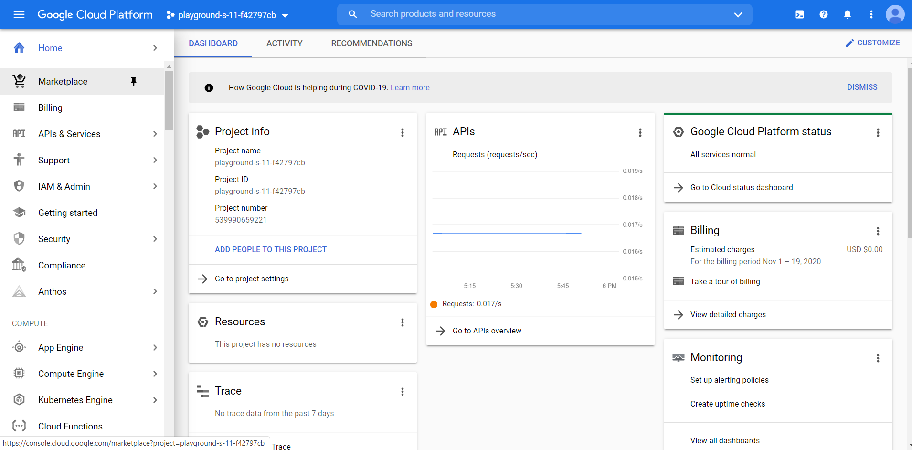

# Youtube Entertainment App

This app tells you about the most searched result of a particular input you give. The input can be the name of a music artist or a computer course which you are interesed in. This app is made using Google Cloud Platform which is a pretty nice offering of Google.

## Installation

This App needs a Google Cloud Platform Account, so make sure you have one created and also the project in which you'll be working. I will show you the steps how to configure GCP inorder to run this application.

## Steps For Installation

### Step 1- Login to your Google Cloud Platform Console.

### Step 2- Create an Actions Project
Visit- https://accounts.google.com/ServiceLogin/signinchooser?passive=1209600&osid=1&continue=https%3A%2F%2Fconsole.actions.google.com%2F&followup=https%3A%2F%2Fconsole.actions.google.com%2F&flowName=GlifWebSignIn&flowEntry=ServiceLogin

And Dashboard will look like this.

### Step 3- Click on NEW PROJECT and Import your project

### Step 4- Then follow the steps as below and click on BUILD.

Then you will be asked to sign in and then you will reach the Dagnolflow Dahboard.

### Step 5- Name your project and click SAVE.

### Step 6- Then Click on Default Welcome Content and make sure Intents is selected on the left navigation menu. It will look as below.

### Step 7- Then move down to Responses section and delete the existing text written there.

Now Click ADD RESPONSES > Text Response. And type "Hello there and welcome to youtube Entertainment! What artist or educational courses are you searching for".
And click SAVE.

### Step 8- Click on the '+' beside intents in the left navigation menu.

### Step 9- Type the intent name and click 'Add Training and Phases'. Type in your training phase and press Enter and select that phase to assign it a entity. It will look as follows.

### Step 10- Enter multiple training phases and assign them entities as below.

### Step 11- Now click below on 'Add Action and parameters' and check the box in front of 'any'. Now click on 'Define Prompt' and type in 'What do you want to look up  for?'. As below:-

### Step 12- Now go on Responses section below and click '+' and add Google Assistant and check the 'Set the intent as end of conversation'. Then go on to Fulfillment section and enable it. Finally, it will look like this.

### Step 13- Now move back to the console and go to 'API and Services' and enable the following API.

